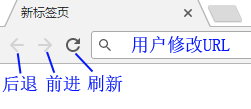
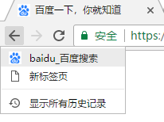

# my-router

在服务器端，路由是根据不同的Url路由，拼接出对应的视图页面技术。前后分离后，路由概念慢慢渗透到前端，现在连Reac Native、flutter、微信小程序等App框架也引入了路由的概念。

## 更接近App的WebApp路由系统——my-router

目前主流的WebApp路由，都是基于浏览器的地址栏开发的。因为浏览器地址栏将URL暴露给用户，WebApp的路由无法限制（引导）用户的工作流，也无法监听移动设备的返回键。

用户可以后退、前进、刷新页面、修改URL

用户可以从缓存的历史记录中跳来跳去

**my-router**设计的目的就是寻找一套接近App的WebApp路由系统，我们试图进一步抽象history对象和location对象，屏蔽了浏览器地址栏的一些鸡肋而且容易出现漏洞的功能，限制了用户的一部分自由，但是提高了用户体验，使用户享受到更接近原生APP的的路由系统。而对于程序员，my-router会提供更全面的API，同时让开发者不再受浏览器的束缚，让大家享受路由开发工作。

WebApp、App与my-router的比较。

||webapp路由|app路由|my-router|
|----|----|----|----|
|用户能够看见URL|能|不能|能|
|用户可以修改URL|能|不能|**可以禁止（不推荐）**|
|能够查看浏览记录|按住返回键可查看历史记录|不能|**不能**|
|前进按钮|有|没有|**屏蔽**|
|返回按钮|有|安卓有，IOS没有|有|
|返回事件|不能监听|能|**能**|
|用户可以刷新|可以|不能|可以|

## [my-router-history](./packages/my-router-history "") 

旨在用于浏览器上实现高仿APP式的单页面路由。**my-reoute-history**屏蔽了浏览器的诸多行为：记录用户历史记录、前进按钮等，并监听用户返回动作，使得WebApp路由变得更像App。可用于PWA路由开发、WebApp路由开发、微信小程序路由移植等场景。

该项目并不依赖**my-router**，因此如果你感兴趣开发一个仿App的路由，可以直接参考甚至使用**my-reoute-history**。

## my-router

一个基于异步的路由系统，my-router提供了路由会话概念，让路由跳转开发变得更容易。

