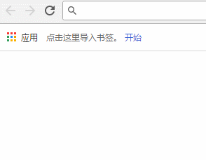
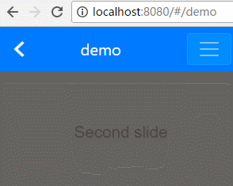

# my-reoute-history

**my-reoute-history**是[my-reoute](https://github.com/laden666666/my-router "") 的一个子项目，旨在用于浏览器上实现高仿APP式的单页面路由。**my-reoute-history**屏蔽了浏览器的诸多行为：记录用户历史记录、前进按钮等，并监听用户返回动作，使得WebApp路由变得更像App。可用于PWA路由开发、WebApp路由开发、微信小程序路由移植等场景。

## 主要功能

**my-reoute-history**的主要功能如下：

### 增加返回页面

**my-reoute-history**会在用户进入Web页面后，插入一个专门监听返回行为的页面。如下图用户进入网页后后，会自动地增加一条名为“返回”的浏览记录。

### 用户跳转页面后，不产生浏览记录

浏览器的地址栏会收集用户的浏览记录，**my-reoute-history**屏蔽了这一行为。因为App会试图用自己的导航去引导用户，而历史记录会让用户跳出App精心设计的导航，使得工作流变动混乱，用户体验变得更差。

如下图，用户在地址栏输入地址“/demo”后，页面跳转，但是浏览器中仅存在“返回”一条记录，看不到“首页”记录。

### 禁用地址栏的前进按钮

浏览器中，用户返回上一页后，地址栏的“前进按钮”就会变为可点击状态，用户点击“前进按钮”会回到之前的页面。而**my-reoute-history**屏蔽了这一行为，因为“前进按钮”在App中也是没有的。如下图，用户点击返回后，前进按钮仍然是不可用状态。

如下图，用户后退后，前进页面仍不可点。

## 其他功能

### 虚拟历史记录

浏览器地址栏的历史记录是开发者不可访问的，**my-reoute-history**提供了一个虚拟历史记录的功能，用于代替history的历史记录。开发者可以访问虚拟历史记录，并动态的删除、增加用户的访问记录。

### 禁止用户修改URL

在浏览器中，用户可以修改URL，**my-reoute-history**可以屏蔽这一行为，当用户修改URL后，会用当前页面的URL覆盖掉用户修改的URL。

虽然**my-reoute-history**可以屏蔽用户修改URL，但是**my-reoute-history却不建议开发者开启这项功能**，因为我们毕竟是在浏览器中，禁止修改URL，会降低用户的使用体验，这也违背了**my-reoute-history**设计的初衷。

## 原理

**my-reoute-history**实现原理是返回键劫持，当用户打开页面时候，my-reoute-history会动态插入一个返回键劫持页面，用于监听用户的返回动作。同时使用hashchange事件监听url的hash改变。无论用户前进、后退都会先返回到返回页面，然后再由返回页面进行前进、后台、替换的行为。

### 目标是提升用户体验

目前返回键劫持主要用于在页面中嵌入广告等不法行为，而**my-reoute-history**致力于提升用户体验，引导用户遵循App式的导航，希望大家能够正确的使用**my-reoute-history**，目标是**提升用户体验**，而不是其他。

基于**返回键劫持**的现状，Chrome浏览器已经着手准备未来禁止这一行为，**my-reoute-history**会持续跟进改进。

